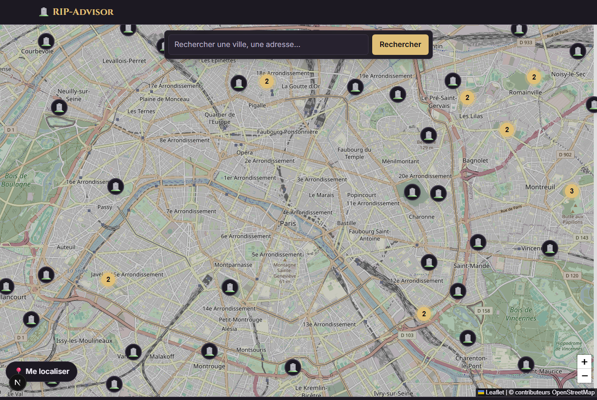
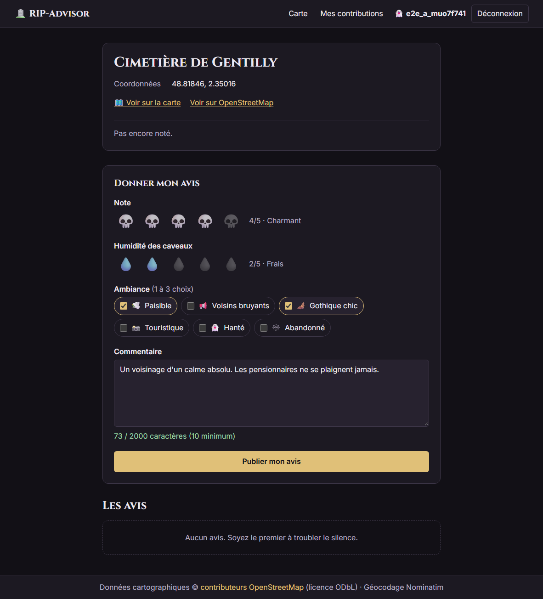
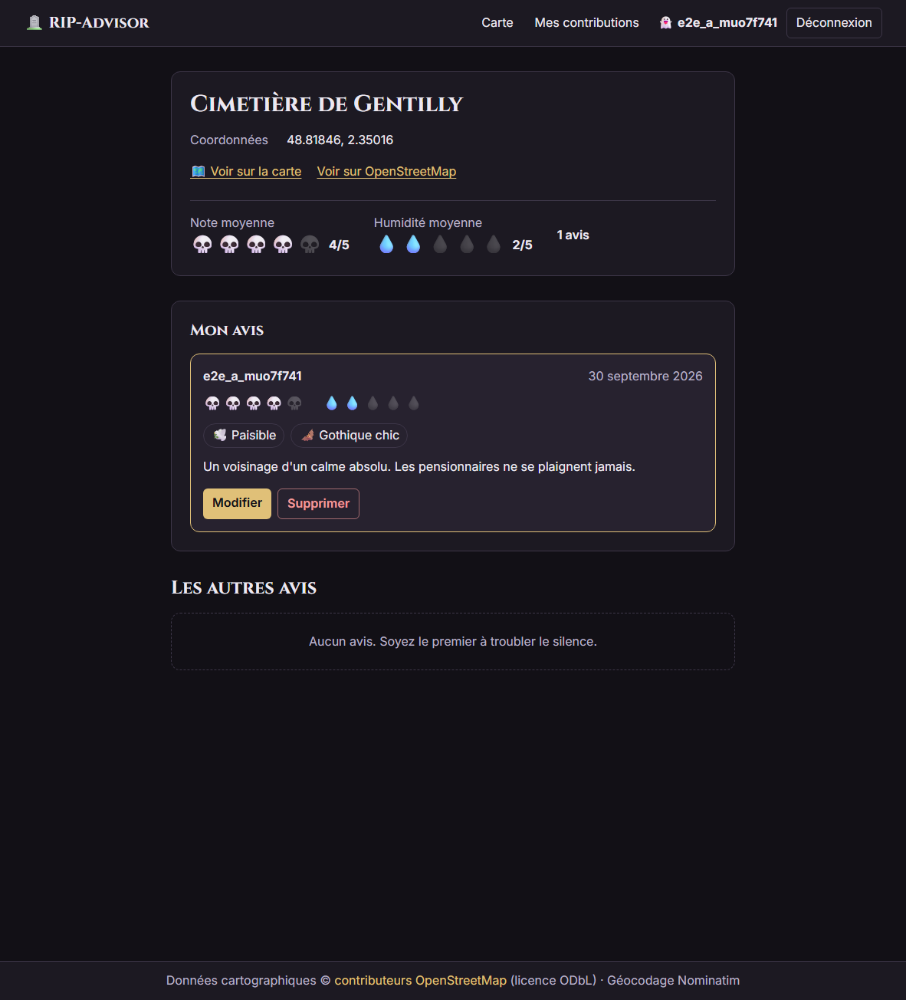

# 🪦 RIP-Advisor — le TripAdvisor de l'Au-delà

**➡️ Application en ligne : https://rip-avisore.vercel.app**

RIP-Advisor est une carte mondiale des vrais cimetières (données OpenStreetMap). Une fois connecté, chacun peut y laisser un avis : note en crânes 💀, taux d'humidité des caveaux en gouttes 💧, ambiance (paisible, hanté, gothique chic…) et commentaire.

Le cœur du projet est un **CRUD complet et sécurisé côté serveur** sur les avis, protégé par trois couches indépendantes : validation zod, identité vérifiée dans chaque Server Action, et Row Level Security PostgreSQL.

---

## Captures d'écran

| Carte mondiale | Fiche d'un cimetière et formulaire d'avis | Avis publié |
|---|---|---|
|  |  |  |

## Stack

| Rôle | Choix |
|---|---|
| Framework | Next.js 16 (App Router, Server Actions), TypeScript strict |
| BDD + Auth | Supabase (PostgreSQL, Auth, RLS) via `@supabase/ssr` |
| Carte | Leaflet, `react-leaflet`, `react-leaflet-cluster` |
| Données | API Overpass (cimetières OSM) et Nominatim (recherche de lieu), appelées côté serveur uniquement |
| Validation | zod (schémas partagés client/serveur) |
| Style | Tailwind CSS 4 |
| Tests | Vitest |
| Hébergement | Vercel |

## Prérequis

- **Node.js 20.9 ou plus récent** (`node -v`)
- Un compte **Supabase** gratuit : https://supabase.com

## Installation locale pas à pas

1. Cloner le dépôt :
   ```bash
   git clone https://github.com/Faonpingoin634/RIP-avisore.git
   cd RIP-avisore
   ```
2. Installer les dépendances :
   ```bash
   npm install
   ```
3. Créer un projet sur https://supabase.com (**New project**, région au choix, mot de passe généré).
4. Dans Supabase, ouvrir **SQL Editor**, puis **New query**. Coller tout le contenu de [`supabase/migrations/0001_init.sql`](supabase/migrations/0001_init.sql) et cliquer sur **Run**. Le message « Success. No rows returned » doit s'afficher.
5. Aller dans **Authentication → Sign In / Providers → Email**, désactiver **Confirm email**, puis cliquer sur **Save**. Sans cela, l'inscription attend une confirmation par email.
6. Copier `.env.example` en `.env.local`, puis remplir les valeurs (**Project Settings → API Keys**) :

   | Variable | Où la trouver |
   |---|---|
   | `NEXT_PUBLIC_SUPABASE_URL` | URL du projet (`https://xxxx.supabase.co`) |
   | `NEXT_PUBLIC_SUPABASE_ANON_KEY` | clé **Publishable** (ou *anon* dans l'onglet *Legacy API keys*) |
   | `SUPABASE_SERVICE_ROLE_KEY` | clé **Secret** (ou *service_role*). ⚠️ Serveur uniquement, ne jamais la commiter |
   | `NOMINATIM_CONTACT_EMAIL` | votre email : les politiques d'usage d'OpenStreetMap exigent un contact |

7. Lancer l'application :
   ```bash
   npm run dev
   ```
   puis ouvrir http://localhost:3000

## Déploiement sur Vercel

1. Sur https://vercel.com, cliquer sur **Add New… → Project** et importer le dépôt GitHub. Le preset **Next.js** est détecté automatiquement.
2. Dans **Environment Variables**, ajouter les 4 variables de `.env.local`, puis cliquer sur **Deploy**.
3. Dans Supabase, ouvrir **Authentication → URL Configuration** :
   - *Site URL* : l'URL Vercel (ex. `https://rip-avisore.vercel.app`) ;
   - *Redirect URLs* : `http://localhost:3000/**` et `https://<url-vercel>/**`.

## Scripts

| Commande | Rôle |
|---|---|
| `npm run dev` | serveur de développement (http://localhost:3000) |
| `npm run build` | build de production |
| `npm start` | lance le build de production |
| `npm run lint` | ESLint |
| `npm run typecheck` | `tsc --noEmit` |
| `npm test` | tests Vitest |

## Architecture

```
app/                    pages (App Router), Server Actions (app/actions), proxys OSM (app/api)
components/             map/ (Leaflet, client uniquement), reviews/, auth/, ui/, layout/
lib/
  osm/                  cells.ts (grille), overpass.ts (client + parseur), nominatim.ts
  repositories/         accès aux données Supabase (pattern Repository)
  services/             cas d'usage (CemeteryService, ReviewService, AuthService) + factory.ts
  validation/           schémas zod (avis, auth)
  map/                  CemeteryStore : cache côté client des cellules (pattern Observer)
  supabase/             clients serveur / navigateur / admin (server-only) / public
proxy.ts                rafraîchissement de la session Supabase (ex-middleware.ts, renommé par Next 16)
supabase/migrations/    schéma SQL, RLS, vue des moyennes
tests/                  tests Vitest
```

### Principes et design patterns

- **Repository** (`CemeteryRepository`, `ReviewRepository`) : toute requête SQL est isolée derrière une classe qui reçoit son client Supabase par **injection de dépendances**.
- **Service / Facade** (`CemeteryService`, `ReviewService`, `AuthService`) : la logique métier, testée avec de faux repositories.
- **Composition root / Factory** (`lib/services/factory.ts`) : c'est le seul endroit qui décide quel client Supabase reçoit chaque composant. Le client admin n'y est donné qu'au repository d'écriture des cimetières.
- **Value Object** (`Cell`) : une cellule de grille immuable, validée à la construction.
- **Builder** (`OverpassQuery`) et **chaîne de secours** (`OverpassClient`, qui essaie les endpoints dans l'ordre).
- **Observer** (`CemeteryStore` + `useSyncExternalStore`) : la carte s'abonne au cache des cimetières.

### Modèle de données

- `profiles` : pseudo public, créé automatiquement par un trigger à l'inscription.
- `cemeteries` : cache des cimetières **consultés** (clé unique `osm_type` + `osm_id`). On ne pré-importe rien ; seul le serveur y écrit.
- `reviews` : note 1-5, humidité 1-5, 1 à 3 ambiances (enum), commentaire de 10 à 2000 caractères. **Un seul avis par utilisateur et par cimetière** (`unique (cemetery_id, user_id)`).
- `cemetery_ratings` : vue qui calcule le nombre d'avis et les moyennes.

### Chargement des cimetières par cellules et cache

- Le monde est découpé en cellules de 0,1° × 0,1° (ex. `488_23` pour Paris). À partir du zoom 12, la carte demande les cellules visibles (16 au maximum) à `GET /api/cemeteries?cell=…`, avec un debounce de 400 ms et 2 requêtes simultanées au plus (limite des serveurs Overpass publics).
- En dessous du zoom 12, seuls les cimetières déjà notés s'affichent (`/api/cemeteries/reviewed`), avec le bandeau « Zoomez… ».
- Côté serveur, la réponse d'Overpass est mise en cache **7 jours** (`fetch` + `revalidate`). La réponse complète, qui inclut les notes, n'est gardée que **60 s** par le CDN (`s-maxage=60`) pour qu'un nouvel avis apparaisse vite sur le marqueur. C'est un choix assumé par rapport aux 24 h prévues dans le cahier des charges.
- **Fiche** : au premier affichage, le cimetière est redemandé à Overpass, on vérifie qu'il porte bien `landuse=cemetery` ou `amenity=grave_yard`, puis il est inséré par le client admin. Les données insérées ne viennent jamais du navigateur.

### Les trois couches de sécurité

1. **Validation zod côté serveur** dans chaque Server Action : notes entières de 1 à 5, 1 à 3 ambiances distinctes de l'enum, commentaire nettoyé (`trim`) de 10 à 2000 caractères, identifiants UUID. La validation dans le navigateur n'est qu'un confort.
2. **Identité vérifiée** : `supabase.auth.getUser()` dans chaque action (jamais `getSession()`). Le `user_id` écrit vient toujours de là, jamais du formulaire. Les modifications et suppressions sont filtrées par `id` **et** `user_id`, puis on vérifie qu'une ligne a bien été touchée.
3. **RLS et contraintes SQL** : lecture publique, écriture réservée à l'auteur. Les droits `UPDATE` sont limités aux colonnes `rating, humidity, vibes, comment`, donc un avis ne peut pas être déplacé vers un autre cimetière ou un autre auteur. Aucune policy d'écriture n'existe sur `cemeteries`.

Les erreurs Postgres sont traduites en messages français. Le message brut n'est jamais affiché ; par exemple, `23505` devient « Vous avez déjà donné votre avis sur ce cimetière », avec un lien de modification. Le paramètre `?next=` n'accepte que des chemins internes, pour éviter les redirections ouvertes.

### Écarts assumés par rapport au cahier des charges

| Écart | Raison |
|---|---|
| `proxy.ts` au lieu de `middleware.ts` | Next.js 16 a renommé cette convention ; `middleware.ts` est déprécié. |
| Vitest 4.1 au lieu de la dernière version (5) | Vitest 5 exige Node 22, or le projet doit tourner sur Node 20. |
| Cache CDN de 60 s au lieu de 24 h sur `/api/cemeteries` | La réponse contient les notes en direct (voir plus haut). |
| `User-Agent` identifié sur Overpass | `overpass-api.de` répond `406` aux clients anonymes. |

## Limites connues

- **Dépendance aux serveurs publics Overpass et Nominatim.** Ils sont gratuits et partagés, donc parfois saturés (réponses 429 ou 504, lenteurs). La première ouverture d'une zone peut prendre plusieurs secondes.
- **Mode dégradé** : si tous les serveurs Overpass échouent (dans un budget de 45 s), la carte affiche les cimetières déjà connus en base, avec le bandeau « Les données OpenStreetMap sont momentanément indisponibles ». Une fiche jamais consultée affiche alors une page « Réessayer ». Aucun écran d'erreur bloquant.
- La recherche de lieu se lance à la soumission du formulaire, sans autocomplétion, comme l'exige la politique d'usage de Nominatim.
- Pas de réinitialisation de mot de passe (hors périmètre).

## Scénario de test manuel

1. Ouvrir la carte : des 🪦 apparaissent autour de Paris. Rechercher « Buenos Aires », choisir le résultat et zoomer : les cimetières locaux (La Chacarita…) s'affichent.
2. Dézoomer sous le niveau 12 : seuls les cimetières notés restent, avec le bandeau « Zoomez pour voir tous les cimetières ».
3. Cliquer sur « Me localiser » et refuser l'autorisation : un message clair s'affiche.
4. Cliquer sur un marqueur, puis sur « Voir la fiche » : la fiche s'ouvre et le cimetière est enregistré en base. L'URL `/cimetieres/node/1` (pas un cimetière) affiche la 404 « Cette tombe est vide ».
5. S'inscrire (pseudo, email, mot de passe de 8 caractères ou plus) : le pseudo s'affiche dans l'en-tête. Réessayer avec le même pseudo : « Ce pseudo est déjà pris ».
6. Sur une fiche, publier un avis : il apparaît en « Mon avis », dans « Mes contributions » et sur le marqueur (badge 💀 avec la note), et les moyennes se mettent à jour.
7. Modifier l'avis : « (modifié) » s'affiche. Le supprimer : une confirmation est demandée.
8. Se connecter avec un second compte : les boutons Modifier et Supprimer n'apparaissent pas sur l'avis du premier, et `/avis/<id>/modifier` renvoie la 404.
9. Sécurité côté serveur : une note de 0 ou 6, une humidité hors bornes, 0 ou 4 ambiances, une ambiance inconnue ou un commentaire vide ou fait d'espaces sont refusés par la Server Action (couverts par `tests/review-validation.test.ts`), puis par les contraintes SQL.

## Crédits

- Données cartographiques © [contributeurs OpenStreetMap](https://www.openstreetmap.org/copyright), licence ODbL.
- Données des cimetières : [API Overpass](https://overpass-api.de). Géocodage : [Nominatim](https://nominatim.org).
- Fond de carte : tuiles OpenStreetMap.
